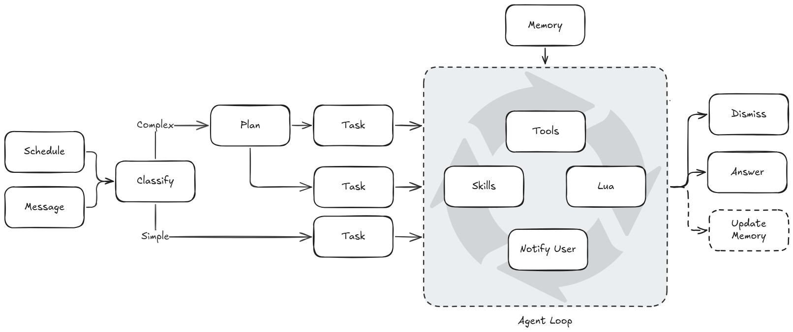
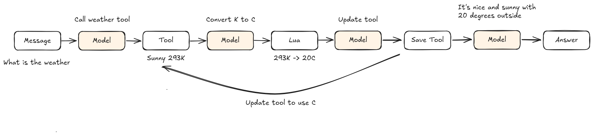
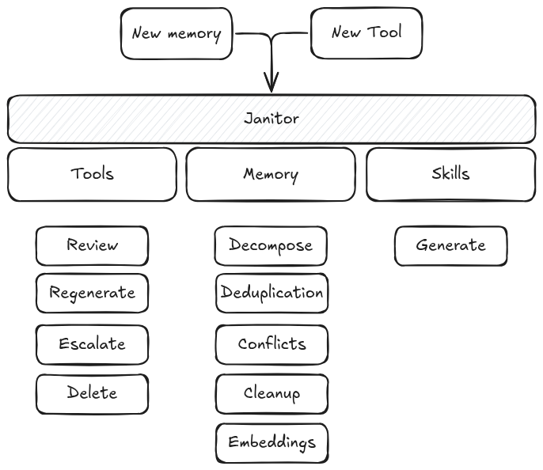

<div align="center">
  
  <h1>Marrow</h1>
  <p>A lean, open source agent framework for personal workflow automation.</p>
</div>

## About

Marrow is my take on a simple agent. It starts off quite bare with only a basic understanding of the world. It has a few built-in tools, but most will be written by itself during its lifetime. It learns from your conversation, building up a searchable memory of facts and a set of skills it can reuse.

Marrow is built as four components: the library that contains most of the core logic, the CLI for one-off queries and agent scripting, the Discord bot for daily use, and a read-only web dashboard for observing what the agent is doing.

**PROJECT STATUS**: My personal playground, not ready for other people to use but if you like to try it out ... feel free. Expect a lot of breaking changes.

## Background

It started with [OpenClaw](https://github.com/openclaw/openclaw). I installed it and started to play with it a little and it was really fun and powerful. I liked the general concept but I felt that the entire thing was hard for me to grasp, and understand how it fit together. When it broke itself and I had no idea how to fix it, I started to tinker with a solution of my own.

## Agent Loop

Here is a basic overview of the agent loop that is triggered when a message is sent in. Relevant memories are pulled into context, and the agent sees a lightweight catalog of available skills it can load on demand. Skills that match keywords in the task are tagged as "suggested" so the model knows which to load first. The agent has access to built-in tools (called via `call_tool`) and tools created by previous agent loops written in Lua. It can execute multiple actions in parallel within a single step. The agent always has the option to write and run inline Lua code for custom HTTP calls and data processing. If the result is reusable, it may save it for future loops.



The message is simply the message you wrote, in Discord or at the CLI. If you have created a schedule, the message is whatever is written in the schedule's description. The message is sent into the loop that may look like this:



It can create long chains of model calls like this. There is a cap of 25 steps, but a transition system keeps runs short in practice. When the agent calls the same tool twice and gets the same result, the duplicate is blocked and never added to history — the model sees a single message pointing it back to the original result. This prevents the agent from spinning on repeated calls and keeps the context clean. Other guardrails warn the model when the step budget is running low. If the model has everything it needs in context (typically from memory), it may respond directly (`Message -> Model -> Answer`).

There are two ways into the agent loop. One is a message initiated by the user. The other is a scheduled task created by an earlier agent loop. The loop can exit in two ways: with an answer back to the user (`done`), or silently (`dismiss`) when the agent completed its work but has nothing to report — useful for monitoring and conditional notification tasks. If we hit 25 steps, an answer is forced.

### Planner

Before the agent loop runs, a planner decides how to approach the task. The fast model triages the task as **simple** or **complex**. Simple tasks (a single tool call, a direct question) go straight into the agent loop unchanged. Complex tasks — those needing multiple data sources or sequential operations — get decomposed into a plan.

The fast model breaks the task into 2–5 todo items, each with an objective and acceptance criteria. Each item then runs its own agent loop with a full 25-step budget and fresh history, so the model only needs to focus on one small thing at a time. Between items, the fast model evaluates whether the step succeeded and builds a summary (including actual result data) that gets injected as context for the next item. If an item fails, it gets one retry with the failure context before being skipped.

This plan→todo→execute pattern is designed to work well with open-weight models that struggle when asked to reason about the full problem and execute simultaneously. Every fallback degrades to the existing single-loop behavior: if triage fails, planning fails, or the plan has only one item, the task runs through the normal agent loop.

### Memories

Memories are facts. They can be manipulated via tools during the agent run, or via the post-process memory management logic, where a non-blocking background task asks the model "is there anything we should remember from this exchange?".

During the agent loop, relevant memories are retrieved from the database and injected into the context. The janitor process maintains memories.

### Skills

Skills are documents created from memories, like "this is how to read the user's calendar". Skills are managed by the janitor process. The agent sees a lightweight catalog (name + short description) and can load a skill's full content on demand during the loop. Skills whose descriptions share keywords with the current task are tagged as suggested in the catalog, nudging the model to load them before guessing URLs or credentials.

### Tools

We have a few built-in tools written in Rust. They work as building blocks for the agent to build more complex tools on, or to use directly. The agent can also write sandboxed tools in Lua (and optionally save them). Built-in tools include CalDAV calendar/task management, RSS feeds, HTTP fetching, Stockholm transit, file storage, memory management, schedule management, and a key-value state store for tracking transient data across scheduled runs.

## Janitor

The janitor is a background process that does various maintenance tasks. It maintains agent-written Lua tools, the memory and skills. For tools, it reviews them, regenerates fixes, and removes the ones it can't repair. For memories, it decomposes large blobs into atomic facts, backfills embeddings for new facts, deduplicates and resolves conflicts, and regenerates skills as memories accumulate. Note that in plain CLI mode you need `--janitor` for a one-off pass, or `--daemon` to keep it running in the background. Marrow Discord runs it automatically.



## Schedules

Schedules are recurring (or one-shot) prompts that re-enter the agent loop on their own. They are created by the agent itself when you ask it to "remind me at 8am every weekday" it sets one up. Each schedule has a description (the prompt that gets re-run), a repeat spec (`daily`, `every_n_hours`, `weekly`, or `once`), and remembers which frontend (and channel) created it so the answer goes back to the right place. There is an overlap protection so a schedule never runs twice in parallel. Note that in plain CLI mode you need `--run-schedules` for a one-off pass, or `--daemon` to keep the heartbeat running in the background. Marrow Discord runs it automatically.

## CLI

Run with `--prompt` for one-shot use, or without it to drop into an interactive REPL that keeps conversation history and auto-summarizes once it grows. `cargo run -p marrow-cli -- --help` for the full list of flags. stdout is the response, stderr is progress and diagnostics.

## Dashboard

`marrow-dash` is a read-only web dashboard that shows what the agent has been doing. It reads event logs, memory, tools, skills, and schedules — never writes to any data source. Run it with `cargo run -p marrow-dash` and open `localhost:3000`.

### Debug Endpoints

When a `debug_token` is set in the `[dash]` config section, two debug endpoints become available:

- `GET /debug/events?token=<token>` — tail of the event log (`events.jsonl`)
- `GET /debug/raw?token=<token>` — tail of the raw request/response log (`raw_requests.log`)

Both return plain text (last ~2 MB of the file), designed for `curl` download and local analysis. If no token is configured, the endpoints are not mounted. A wrong or missing token returns 403.

The raw request log captures every HTTP request sent to and response received from LLM providers across all backends and roles. This is useful for debugging production issues without reproducing them locally.

## Discord Bot

Marrow runs as a Discord bot that responds to @mentions and DMs. See [DISCORD.md](DISCORD.md) for full setup instructions.

## Configuration

All configuration lives in `config.toml`. Copy [`config.example.toml`](config.example.toml) as a starting point — it documents every role and provider option inline.

| Role | Used for | Required |
|---|---|---|
| `agent` | Agent loop planner — drives task execution and inline Lua generation | Yes |
| `fast` | Task triage, plan generation, step evaluation, session summarization, and memory retrieval | Yes |
| `janitor` | Lua tool review, regeneration, and toolbox/memory cleanup | If janitor enabled |
| `embedding` | Vector memory retrieval | No |

Supported providers:
- **`ollama`** — Ollama Cloud or local. Omit `api_base` for local at `localhost:11434`. Omit `api_key` for local instances.
- **`openai`** — Any OpenAI-compatible API (OpenAI, OpenRouter, Together, Groq, etc.). Requires `api_key`.

## Secrets

Secrets should never be written to memory or skills, the correct place is `secrets.toml`. Copy [`secrets.example.toml`](secrets.example.toml) as a starting point. You need to manually add secrets. Each secret has a `value` and a `description` the model uses to know when to reach for it. Tools access secrets via the `secret()` host function like this:

```lua
local token = secret("github_token")
local resp = http_get("https://api.github.com/user",
    { Authorization = "Bearer " .. token })
```

The model never sees the secret value, only the name and description. When a tool parameter starts with `secret:` (e.g. `secret:github_token`), the runtime resolves it before the tool executes. This also works for `secret:` references embedded inside values, so a URL like `https://host/users/secret:my_user/calendar` is resolved correctly.

Please note that there are always theoretical ways for secrets to leak. For example if the model generated a tool that prints the secret, it will be added to the conversation history, and potentially picked up as a memory. At the moment there is no special logic to try to block this.

## License

MIT
